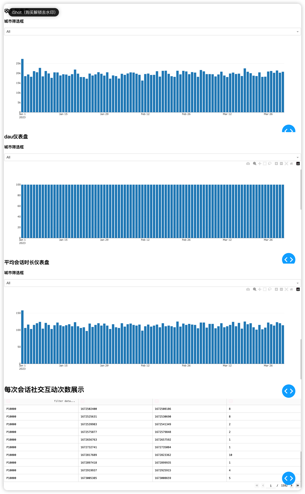

### 任务 1：模拟数据集生成
```
1、安装simpy模块：pip install simpy
2、执行generate_events.py脚本生成generate_events.csv文件
```
### 任务 2：数据管道和 ETL 过程
* etl思路：首先观察任务1中的csv数据生成脚本及csv数据文件可知，生成的数据是模拟用户在游戏中由登入只登出过程中所产生的行为及购买日志数据，具体包括SessionStart（登入）、LevelComplete（升级）、InAppPurchase（购买）、SocialInteraction（社交）、SessionEnd（登出）这几部分数据，所以根据这个清洗思路，我将原始日志清洗为四张数仓表，如下（每张表中都放入了用户基础信息，实际应用中也可将这种冗余信息抽取至一张用户维表中）
```
# dwd_user_role_log_df（登录日志表）
    dt text '日期分区', 
    player_id text '用户id', 
    device_type text '设备类型', 
    location text '设备所在地', 
    event_timestamp integer '日志时间戳', 
    event_type text '登录类型（login:登入，logout:登出）'
# dwd_user_social_inter_df（社交信息表）
    dt text '日期分区', 
    player_id text '用户id', 
    device_type text '设备类型', 
    location text '设备所在地', 
    event_timestamp integer '日志时间戳', 
    social_type text '社交类型',
    social_content text '社交内容'
# dwd_income_trade_df（购买记录订单表）
    dt text '日期分区', 
    player_id text '用户id', 
    device_type text '设备类型', 
    location text '设备所在地', 
    event_timestamp integer '日志时间戳', 
    item_id text '商品id（无数据）',
    item_name text '商品名称（无数据）',
    trade_amt real '商品金额'
# dwd_user_level_df（用户等级表）
    dt text '日期分区', 
    player_id text '用户id', 
    device_type text '设备类型', 
    location text '设备所在地', 
    event_timestamp integer '日志时间戳', 
    level_detail integer '用户等级'
```
* etl脚本及脚本内方法概览：ods_etl.py
```
|- timestr_to_timestamp：时间戳转换方法
|- connect_db：连接sqlite3数据库方法
|- init_table：初始化数据库表方法
|- ods_etl_func：日志数据etl清洗方法
从主方法中进入，依次进行初始化数据库表、读取csv数据、加工原始数据为上述四张表结构的dataframe、存储数据操作
```
### 任务 3：分析仪表板开发
* 仪表盘代码：index_dash.py
具体实现sql在上述代码中

